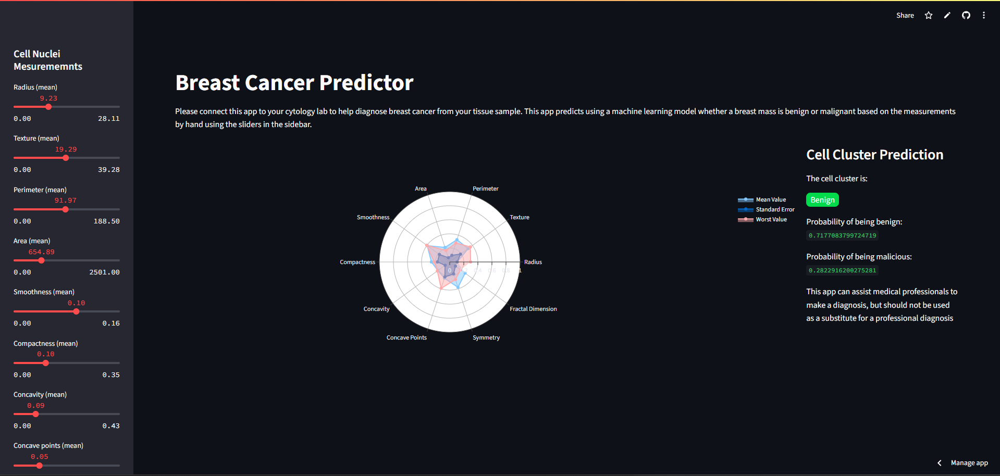

# 🧠 Frontend-Streamlit-CancerPrediction

A simple and effective **breast cancer prediction app** powered by a **Logistic Regression** model and built with **Streamlit**. This project leverages the **Breast Cancer Wisconsin (Diagnostic) Dataset** to classify tumors as **benign** or **malignant** based on features derived from digitized images of fine needle aspirates (FNA) of breast masses.

---

## 📊 Project Overview

This project is divided into two main components:

1. **Model Building (Backend)**
2. **Frontend Deployment using Streamlit**

---

## ✅ Features

- Clean preprocessing of breast cancer data.
- Logistic Regression model trained on labeled data.
- Real-time prediction using a saved model and scaler via Pickle.
- Minimal and responsive frontend using Streamlit.
- Input sliders to adjust sample parameters dynamically.
- Final prediction with visual feedback for users.

---

## 🔍 Dataset Used

- **Name**: Breast Cancer Wisconsin (Diagnostic) Data Set  
- **Source**: [UCI Machine Learning Repository]([https://archive.ics.uci.edu/ml/datasets/Breast+Cancer+Wisconsin+(Diagnostic](https://www.kaggle.com/datasets/uciml/breast-cancer-wisconsin-data)))  
- **Target Labels**:  
  - `M`: Malignant  
  - `B`: Benign  

---

## 🛠 Tech Stack

| Component      | Technology         |
|----------------|--------------------|
| Model          | Logistic Regression (Sklearn) |
| Data Handling  | Pandas, NumPy       |
| Deployment     | Streamlit           |
| Serialization  | Pickle              |
| Visualization  | Plotly              |

---

## 🧪 How It Works

### 📁 Backend:
- Preprocesses and cleans the dataset.
- Trains a `LogisticRegression` classifier.
- Applies `StandardScaler` for normalization.
- Saves both model and scaler using `pickle`.

### 🌐 Frontend:
- Streamlit app reads the saved model and scaler.
- Takes user input from sidebar sliders.
- Scales input and predicts the tumor class.
- Displays results and a confidence score visually.

---

## 🚀 Streamlit App (Live Demo)

👉 **Try the live app here**:  
[🔗 Cancer Prediction App on Streamlit]([https://frontend-app-cancerprediciton-vspdffhx4ztmpjxerbpvpc.streamlit.app/](https://frontend-app-cancerprediciton-vspdffhx4ztmpjxerbpvpc.streamlit.app/))

---

## 🖼 Final Output

> 📌 _Replace `path/to/your/final_result.png` with the actual path or URL to your image._

---

## 📂 Project Structure

